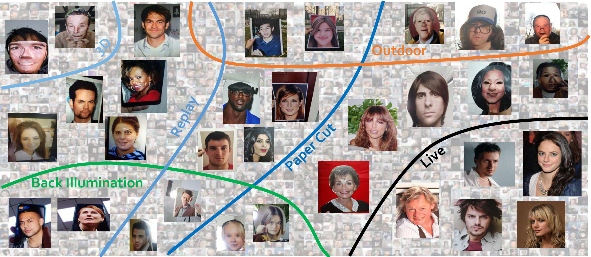
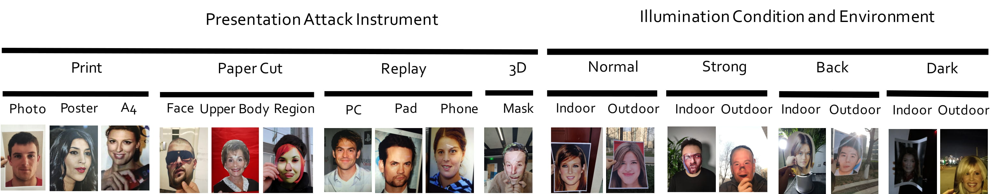

# CelebA-Spoof
**CelebA-Spoof** is a large-scale face anti-spoofing dataset that has **625,537**images from **10,177** subjects, which includes **43** rich attributes on face, illumination,environment and spoof types. Live image selected from the CelebA dataset. We collect and annotate spoof images of CelebA-Spoof.

Among 43 rich attributes, 40 attributes belong to live images including all facial components and accessories such as skin, nose, eyes, eyebrows,  lip, hair, hat, eyeglass. 3 attributes belong to spoof images including spoof types, environments and  illumination conditions.

CelebA-Spoof  can be used to **train and evaluate algorithms of face anti-spoofing**.

## AENet

Based on these rich attributes, we further propose a simple yet powerful multi-task framework, namely AENet. Through AENet,we conduct extensive experiments to explore the roles of semantic informationand geometric information in face anti-spoofing.

## Sample images

